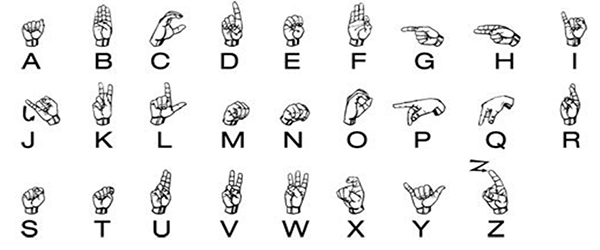
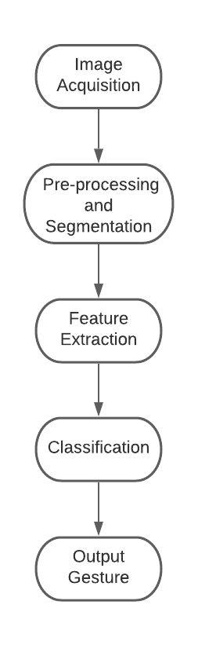
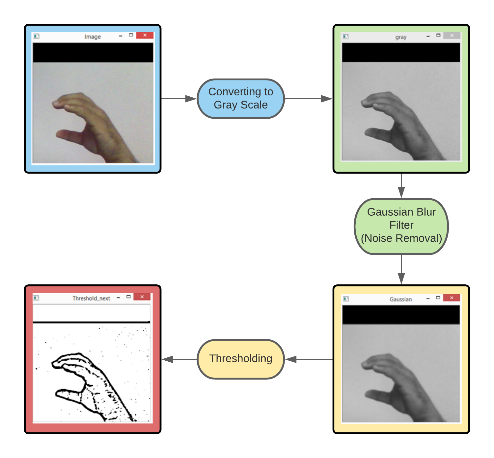
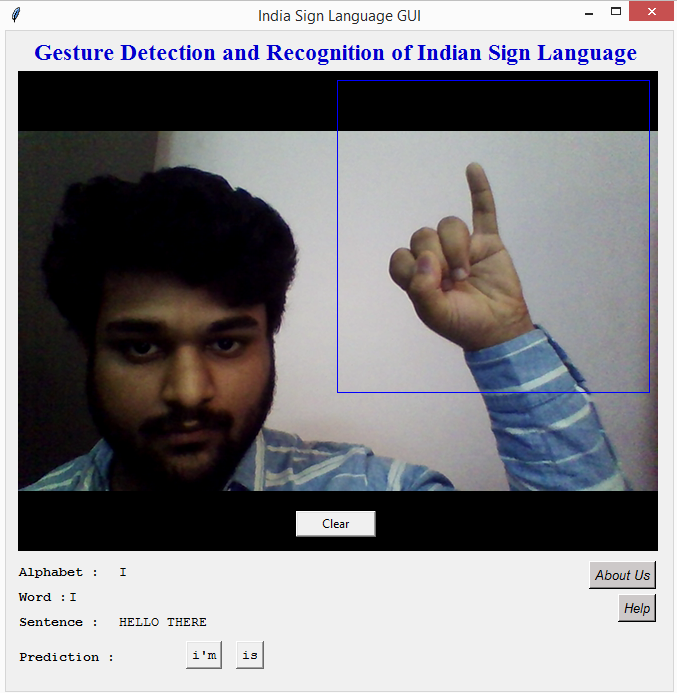

## Sign Language Detection to Text using Deep Learning and Computer Vision

A gesture is a form of non-verbal communication and most important tool for deaf and dumb people. It is a structured way of communication in which every alphabet is assigned to a gesture. Sign language changes with the difference in geography and multiple language spoken in that country.

This project focuses on developing an understanding for Indian Sign Language System which can have an impact on deaf and dumb people's daily lives. Users will be able to interpret what they are saying. This automatic recognition system supports Indian Sign Language alphabet (A-Z) and numerals (0-9). It can be difficult to classify these gestures due to the complexity, similarity between gestures and presence of new gestures emerging out. The non-availability of standard benchmarked dataset further creates a challenge to extract gestures from camera. Therefore we made our own dataset.

Link to dataset can be found on [Google Drive](https://drive.google.com/drive/folders/1qGKPVEasNDw_zQ09gPThffT2Ru7DNbMO?usp=sharing). It contains the pictures used after image preprocessing which are thresholded and fed to the model.

## PROJECT WORKFLOW

### Dependencies
The modules and frameworks can be downloaded from <i>requirements.txt</i> 
Most common ones are :
<ul>
  <h4>Python 3.7.4</h4>
  
  <li>Tensorflow (1.15.0)</li>
  <li>OpenCV (3.4.3.18) </li>
  <li>Keras (2.2.4)</li>
  <li>Scikit Learn (0.24.1)</li>
  <li>Fast-autocomplete (0.7.1)</li>
  <li>Pillow (5.2.0) </li>
  <li>Matplotlib (3.0.1)</li>
  <li>Numpy (1.20.1)</li>
</ul>

### Project Flowchart   

<ol>
  <li>The user feeds the camera with Image Acquisition in the ROI (Region of Interest) where the actions of the user are captured. It also includes the placement of camera, lighting conditions affecting background, and object in the bounding box. The visibility of the hand and proper orientation is to be considered. </li> 
  <li>The second step is the preprocessing stage where the task is to extract the hand gesture of the image from the background. Preprocessing is required for localization of hand gestures. Better the preprocessing stage, easier will be the task of Feature Extraction. </li> 
  <li>The feature extraction and classification is done by Neural networks. The accuracy of the model comes out to be more than 90%. </li> 
  <li>The final stage is the classified output generated by the model. The Character/Numeral interpreted by the model can be shown along with the confidence.</li>
</ol>

### Image Pre-processing
<ol>
  <li>We extract our ROI from the image which is RGB and convert it into gray scale image.</li>  
  <li>Then, we apply our gaussian blur filter to our image which helps us extracting various features of our image and filters out noise.</li>   
  <li>Finally, thresholding is done to achieve the result as shown </li>  
</ol>

### GUI

The project is specially designed for deaf and dumb people; hence we must ensure that there is no complex working and everything should be simple and straight.

A simple GUI is created with a single transition window. The user makes the gesture in the bounding box which is Region of Interest (ROI) and the model interprets the gesture and makes the prediction. GUI also has descriptive information regarding the formation of words and sentences. A sample image for people who don’t know sign language can be found with the help button. 

#### Autocorrect Feature
A python library fast-autocomplete is used to suggest correct alternatives for each input word and display a set of words matching the current word in which the user can select a word to append it to the current sentence. This helps in reducing mistakes committed in spellings and assists in predicting complex words.

